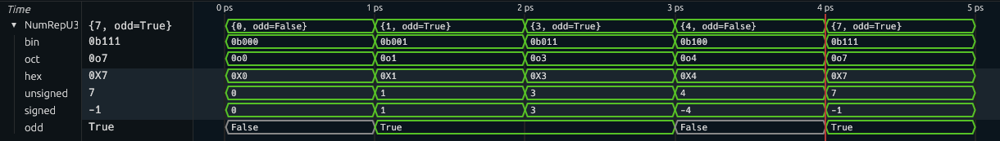
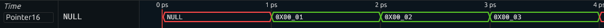

## How to use the advanced translators

Sometimes, the default translators just aren't quite good enough. You might want
to represent types in a way that doesn't quite align with the typical bit layout,
or simply have a little more control than the other translators provide you with,
without resorting to the use of LUTs.

In that case, the AdvancedProduct, AdvancedSum and BitChange translators might be
of use.

> **Note:** These translators all use indices on their binary input. This indexing
> is performed *from left to right*, as if the bits were a string. This means that
> bit 0 is the *most* significant bit.
> 
> Furthermore, all slices are half-open; `(0,5)` refers to `[0,1,2,3,4]`.

### ADVANCED PRODUCT

The AdvancedProduct translator is useful if you want to:

- translate the same bits in different ways
- have a subsignal that does not appear in the toplevel value
- use a subvalue in the toplevel value without adding it as a subsignal
- change the order of subsignals
- include subvalues with different operator precedence contexts

The translator works in 3 steps:

- translate a number of slices in the input with certain subtranslators
- select the subsignals from these translations
- construct the toplevel value from these translations

Suppose we have a type `NumRep a`, which we use to display the type `a` in the
different available number formats, as well as its parity. We can write an
implementation like this:

```hs
instance Waveform a => Waveform (NumRep a) where
  translator = Translator (width @a) $ TAdvancedProduct
    { sliceTrans =
      L.map ((0,width @a),)
        ( tRef (Proxy @a) :                           -- translate as `a`
          L.map (Translator (width @a))               -- translate as numbers
            [ TNumber NFBin (Just (4,"_")) "0b" False
            , TNumber NFOct (Just (4,"_")) "0o" False
            , TNumber NFHex (Just (2,"_")) "0X" False
            , TNumber NFUns (Just (3,"_")) "" False
            , TNumber NFSig (Just (3,"_")) "" False
            ])
      <> [((width @a-1,width @a),tRef $ Proxy @Bool)] -- translate parity bit
    , hierarchy = [("bin",1),("oct",2),("hex",3),("unsigned",4),("signed",5),("odd",6)]
    , valueParts = [VPLit "{",VPRef 0 (-1),VPLit ", odd=",VPRef 6 (-1), VPLit "}"]
    , preco = 11
    }
```

`sliceTrans` contains number translators of every number format, as well as the
default translator of `a`, and a `Bool` translator that's applied to only the last bit.

`hierarchy` then selects the different number formats, as well as the parity, to be
subsignals.

`valueParts` defines that the value should look like `{_, odd=_}`, inserting the
translation using the translator of `a`, as well as the parity.
Both values are rendered with a precedence context of `-1` (no surrounding operators).
Finally, `preco` defines that this value is atomic (precedence `11`).

The result looks like this (for `a = Unsigned 3`):




> **Note:** if you want to take on the style of a subsignal, apply the
> `WSInherit` style using `tStyled`. This only works for subsignals that are
> actually present in the translation. It is impossible to take the style from
> a signal that is only used in the toplevel value.


### ADVANCED SUM

The AdvancedSum translator is useful if you want to:

- switch translators based on bits other than the first `k`
- select translators in ranges of values, rather than just one
- select translators in a different order than `0`, `1`, `2`, etc.

The translator works in 3 steps:

- take a slice of bits from the input binary
- compare the index value against a list of index ranges, selecting the translator
  belonging to the first range containing the index, or otherwise, the default
- translate the *entire* binary value using this translator

Say we have a `Pointer a` type, behaving like `Unsigned a`,
that we want to display in hexadecimal, unless its value is `NULL`.
We can write a `Waveform` instance like this:

```hs
instance KnownNat a => Waveform (Pointer a) where
  translator = Translator (width @(Pointer a))
    $ TAdvancedSum
      { index = (0,width @(Pointer a))
      , defTrans = Translator (width @(Pointer a)) $ TNumber NFHex (Just (2,"_")) False
      , rangeTrans = [((0,1), tConst $ Just ("NULL",WSWarn,11))]
      }
```

For the `index`, we slice the entire binary. We set the default translator
`defTrans` to a numerical one using hexadecimal,
and specify that for an index in the range `[0,1)` (so, `0`),
a constant translator should be used with the value `NULL`.

This is the result for `Pointer 16`:



> **Warning:** The Shockwaves extension uses 128-bit index values.
> This limits the index to 128 bits.
> However, since the ranges are half-open, a range extending to the end would
> need to end with `2^128`, which does not fit in a 128-bit number.


### BITCHANGE

Finally, there is the bitchange translator. This translator does nothing on the
translation end: it simply modifies the binary input before passing it on to
its subtranslator.

You can use this translator when you need to:

- reorder bits
- add or remove bits
- detect undefinedness *
- change from a number to one-hot *
- perform basic binary operations *
- and many more *

> (*) To be added

The translator is based on the BitPart type, which has a number of variants
for creating binary values.

- `BPConcat`: concatenate the binary values produced by its children
- `BPLit`: return literal bits
- `BPSlice`: return a slice of the input bits

Say we have a type `LittleEndian` that is just a 24 bit number, and we want to
display the bytes in hexadecimal format, starting with the least significant byte
on the left. It's possible to achieve this with an AdvancedProduct translator,
but also by reordering the bits using BitChange:

```hs
instance Waveform LittleEndian where
  translator = Translator 24 $ TChangeBits
    { bits = BPConcat [BPSlice (16,24), BPSlice (8,16),BPSlice (0,8)]
    , sub = Translator 24 $ TNumber NFHex (Just (2,"_")) False
    }
```

Now 5, which is `0x00_00_05` gets turned into `0x05_00_00`.

> **Note:** The exact options for `BitPart` are still up for debate, and especially
> `BPSlice` is likely to be turned into two parts: `BPSlice` for slicing _any_ binary value,
> and `BPInput` for referencing the input.
