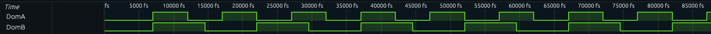
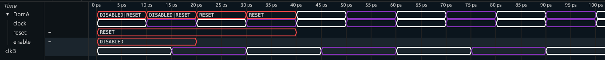

## How to add clock and other domain signals
- advancedDumpVCD clocks
- special clock signals

(experimental feature; subject to change)

It is often useful to add clock, reset and enable signals to your VCD output.


### STANDARD CLOCK WAVEFORMS

The new implementations of `Signal.Trace` and `Shockwaves.Trace` include an `advancedDumpVCD` function
that allows you to add more clocksignals.

You can create a clock signal by supplying its name and period in picoseconds:

```hs
advancedDumpVCD 0 100 5 False signal [("clk",10_000)] []
```

Alternatively, you can trace a domain with `clockWave`:

```hs
advancedDumpVCD 0 100 5 False signal [clockWave @System "clk"] []
```

The resulting waves look like standard 50% duty cycle clock waves:



### SHOCKWAVES CLOCK/RESET/ENABLE SIGNALS

The module `Clash.Shockwaves.Trace.CRE` contains functions for creating special signals.
`traceClock`, `traceReset` and `traceEnable` create signals from the `Clock`, `Reset` and `Enable` types.
They each return these inputs, so you can use them wherever a clock, reset or enable is required.
Alternatively, they can be forcefully evaluated using e.g. `seq`:

```hs
withReset (traceReset "rst" resetGen) myDesign
```

```hs
dumpVCD (...) (traceClock "clk" (clockGen @MyDom) `seq` mysignal) ["mysignal2"]
```

Alternatively, `traceClockResetEnable` takes all three at once (and returns them in a tuple).
This creates one combined signal that shows the clock, unless the system is disabled or being reset:

```hs
mySignal' = traceClockResetEnable clk rst en `seq` mySignal
```



> The clock colors can be customized with style variables `clk_a` and `clk_b`.
> Similarly, the other two can be changed through `reset` and `disabled`.
> The style of a combined reset and disabled state is controlled by style variable `reset_and_disabled`.

These four functions also have equivalents for scenarios with hidden clocks, resets and enables:
`traceHiddenClock`, `traceHiddenReset`, `traceHiddenEnable`, and `traceHiddenClockResetEnable`.
These all take an extra argument which is returned unchanged. Evaluating the results adds the signals.
This makes it easier to add them to a signal with hidden signals:

```hs
macT s (x,y) = (s',s)
  where s' = x * y + s

mac :: HiddenClockResetEnable dom  => Signal dom (Int, Int) -> Signal dom Int
mac = traceHiddenClockResetEnable "mac_CRE" $ mealy macT 0
```