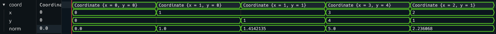

## How to add extra information to your data types
With Shockwaves, you can add extra debug information to your data type. For example,
if you have a `Coordinate` data type that is defined in Carthesian coordinates,
you might want to display the distance to the origin. This data is not directly
available for translation, but we can add it with lookup tables!

The full guide on using lookup tables can be found [here](LUTS.md).

### SETTING UP LUTS
Let's assume we have our datatype `Coordinate`:

```hs
import Clash.Shockwaves

data Coordinate = Coordinate{ x::Int, y::Int }
  deriving (Typeable,Generic,BitPack,NFDataX,Waveform)

norm :: Coordinate -> Float
norm Coordinate{x,y} = sqrt $ fromIntegral (x*x + y*y)
```

First, we modify it to use lookup tables instead:

```hs
{-# LANGUAGE DerivingVia #-}
import Clash.Shockwaves
import Clash.Shockwaves.Waveform
import Clash.Shockwaves.LUT

data Coordinate = Coordinate Int Int
  deriving (Typeable,Generic,BitPack,NFDataX,Show)
  deriving Waveform via WaveformForLUT Coordinate

instance WaveformLUT Coordinate where

norm :: Coordinate -> Float
norm (Coordinate x y) = sqrt $ fromIntegral (x*x + y*y)
```

We can now modify what our data types look like by changing the `WaveformLUT` implementation.


### ADDING A SIGNAL

Let's assume we don't want to change the appearance of the toplevel signal -
this is already covered in the [LUT guide](LUTS.md). 
Instead, we are going to add a subsignal that provides us with extra information.

The `translateL` and `structureL` functions let you overwrite the subsignals that get created.
We can add a signal manually to our `structureL`, and obtain the subsignal values using a special
splitter function `splitNorm`.

```hs
instance WaveformLUT Coordinate where
  structureL = Structure
    [ ("x", structure @Int)
    , ("y", structure @Int)
    , ("norm", structure @Float)
    ]
  translateL = translateWith renderShow splitNorm
    where
      splitNorm _ c@(Coordinate x y) =
        [ ("x", translate x)
        , ("y", translate y)
        , ("norm", translate $ norm c)
        ]
```

> Note: `splitNorm` might error if the coordinate is `undefined`, but the `translateWith` function
> takes care of this.


That's it! If we show our data type in Surfer, we see:



While our data type might be simple enough, adding signals to more complex types
this way would require us to do a lot of manual definitions. Instead, we'd like to
use the default functions as much as possible. It's possible
to use the underlying `Generic`-based functions that are used to create these
subsignals, and simply add the new signals. These internal functions might change,
but can be convenient if there are a lot of standard subsignals.

```hs
import Clash.Shockwaves.Internal.Waveform (translatorG)

instance WaveformLUT Coordinate where
  structureL = Structure (dflt <> extra)
    where
      Structure dflt = structureT $ translatorG @(Rep Coordinate ()) 0 (Data.List.repeat WSNormal)
      extra = [("norm", Structure [])]

  translateL = translateWith renderShow splitNorm
    where
      splitNorm r c =
           splitL r c
        <> [("norm", translate $ norm c)]
```

